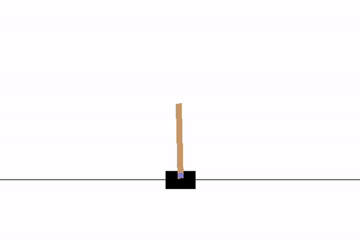
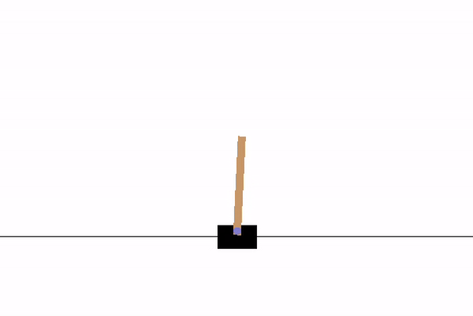
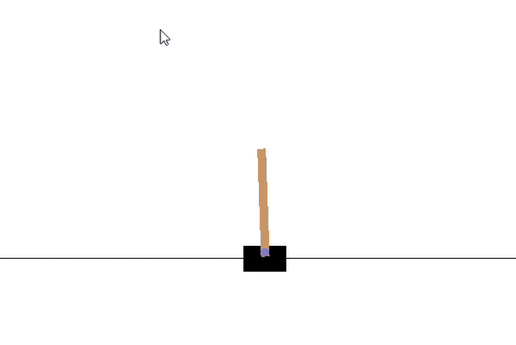
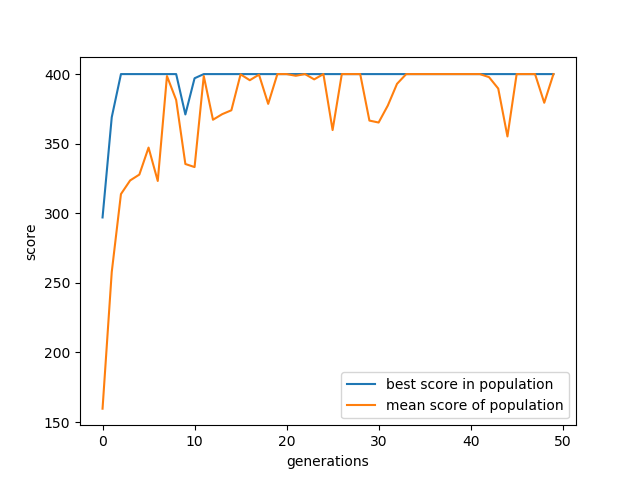
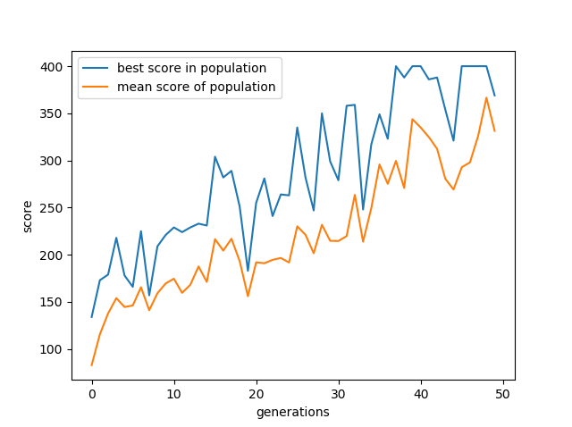

# Genetic-Algorithm-Neural-Network-Toolkit
Genetic Algorithm and Neural Network Toolkit for Reinforcement Learning applications

The **GA-NN** toolkit was designed to facilitate the implementation of **neural networks** on aplications by optimizing the weights of the neural networks using a **genetic algorithm** approach. 

## Requirements:
* [Matplotlib](https://matplotlib.org/)
* [Numpy](https://numpy.org/)
* [OpenAI gym](https://gym.openai.com/)

## Neural Networks:
A **neural network** is a network of neurons connected to one another using synapses that carry weights. The responsibilty of the synapse is to scale the input by the weight its carrying (usually a number between 0 and 1). The neurons on the other hand sum the inputs together and pass this value through an activation function. A neural network can be comprised of multiple layers and is called a **deep neural network**. A single layer of a neural network can be mathematically represented as ) where  is the output vector,  is the input vector,  is the weight matrix of that layer and  represents the activation function. Therefore the aim of machine learning, is to determine the weight matrix such that an unknown input produces a valid output. An example would be **back propagation**, where the weights are initally random, but are adjusted iteratively by comparing the output with known data.    

## Genetic Algorithm:
Another approach for finding the optimal weights in a neural network for a certain task is by using a **genetic algorithm** inspired by the process of natural selection. A population of agents are created each associated with a unique neural network initially having random weights. The agents are then allowed to **explore the universe** based on inputs from the environment. The behavior is initially unpredictable because of the random weights, although it is likely for some of the agents in the population to take a step in the right direction purely based on chance. The environment is designed to **reward** agents that "behave well" and punish agents that "misbehave". Eventually, after a certain number of time-steps, the agents are evaluated based on the accumulated rewards and the next generation is created from the agents that performed well (i.e the weights of the NNs for the next generation is inspired by the weights of the NNs from the current generation that did well). The process can terminate when a desirable behavior is achieved. 

## OpenAI Gym:
The **GA-NN** toolkit was tested on a few environments provided by **OpenAI gym**. Below are examples of the toolkit being used on the cart pole environment, where the objective is to balance a pole on a cart without letting the pole tip over. The toolkit allows the user to input certain hyper parameters such as:
* **The architecture of the neural network** e.g [2,4,1] would correspond to a neural network with two inputs a hidden layer with 4 neurons and a single output
* **Best percentage** the number of top agents chosen fr next generation
* **Mutation factor** the amount by which the next generation will resemble the previous generation

The following results were achieved with a population size of 10 and a neural network with architecture [4,4,4,1]

### Best agent in 1st generation

### Best agent in 10th generation

### Overall best

### Results with different hyperparameters

 
